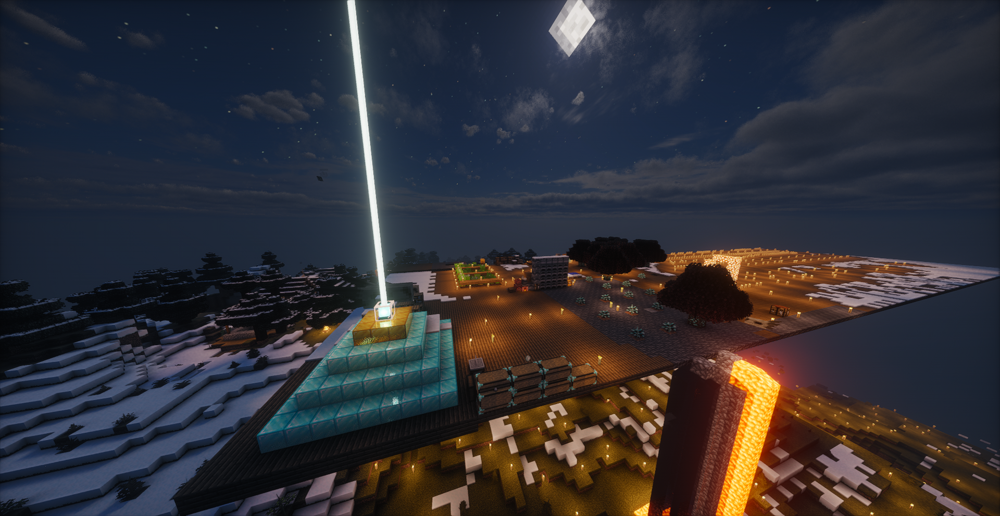

 
    

# 欢迎来到 AFoP v1.1-HotFix 宁然一隅

## AFoP v1.1-HotFix所支持的游戏版本Forge: 1.20.1

## 下载游戏

你可以通过以下链接下载 AFoP v1.1-HotFix：

[点击这里下载 AFoP v1.1-HotFix](https://github.com/INORACLE/MC-Fufu/releases/download/Minecraft/AFoP.v1.1.HotFix.zip)

## 如何开始

**方法一**：解压`AFoP v1.1-HotFix.zip`，完成后使用`PCL`或者`HMCL`任意启动器启动游戏

**方法二**：是压缩包导入启动器自动下载，该方法遵循Minecraft打包协议

## 玩家的家

 
    
 
    
 
    

## 前言

- 你是否想过?
- 偏居一隅之时，习习微风忽而吹开窗，花香与麦香闯进厅堂。
- 行至窗前，南山良田麦轻扬，北山瓜果自品香，纤纤青竹掠影上，自有良人同心赏

## 内容简介

**这是一个以农夫乐事系列为核心，Let's do，凡家物语，静谧四季等为附属的慢节奏养老休闲整合包。**

- 可能大多数人并没有接触过养老整合包，或者说不了解他的玩头在哪?

- 首先，养老包从不是什么为了毕业而去游玩的整合包，它的意义是能让你在游玩的时候静下心

- 去感受这种慢节奏的游戏生活，从而放缓心理上的一些压力或者焦虑。

**整合包的整体特点如下:**

 **舒适体验:** 玩家会出生在村庄(或附近)，并提供一些初始物品，以减小的玩家前期的生存压力，让玩家能更快的投入慢节奏的种田做饭阶段。地狱和
未地的内容被移除了，一些所需物品可以通过上!查看配方获取，从而简化一些必要的步骤，整合包还加入了更便捷更好看的飞行羽翼以供玩家使用。

 **内容丰富:** 近乎将农夫乐事以及其附属和联动模组都加入到该整合包中，有各种风格美食，也有各种琼浆美酒，沁香茶饮。同时还扩展了原版动物、添
加了额外的动物和一些可驯服动物。当然还有不可或缺的家具和装饰，一个合格的养老玩家怎么能不建造一个属于自己的家呢。还少了点什么，当然
是我们的女仆啦，可爱的小女仆谁不喜欢。

 **机制优化:** 或许有人会不适应这种完全养老的整合包，整合包加入了Alex的生物、冰火传说以及天境模组，为了契合养老的主题，将模组的整体难度下
调了一些(冰火也调低了生成权重，不至于走两步一个龙穴)。而且玩家的变强方式也将不再限于探索，种田做饭也能变强，整合包引入了新的伤害
机制，种田做饭可获得更多的经验，随着玩家等级的提高玩家的战斗能力也将提高。同时ban了一些存在前科的实体(可能会导致坏档或者崩溃)，不过也不用担心会影响舒心的养老生活，烦人的东西咱直接一手给他抹了。

 **任务引导:** 考虑到并不是所有人都认识这些模组，整合包添加了魔改和任务系统，以引导玩家去熟悉这些模组和魔改内容，可能也不止是引导，或许还
有一些笑话或骚话。(任务并不是必须要完成的，如果你有自己的游玩计划，完全可以进行忽略)

 **趣味提升:** 整合包内添加了许多彩蛋，希望能为你的休闲生活增添一抹色彩。
(如果觉得任务引导还不够具体可以联系作者修改)

## 游戏特点 养老

- **养老**：体验悠闲的农耕生活。
- **休闲**：放松心情，摆脱现实压力。
- **种田**：精心打理自己的田园和农场。
- **舒适**：创建个性化的家园，享受游戏中的舒适生活。

## 版权声明

AFoP v1.1-HotFix 是由社区开发并维护的修改版本。《Minecraft》是 Mojang AB 的商标。请遵守相关版权规定和游戏条款。

本文相关内容来源：MC百科

---

返回 [README.md](../..README.md)
